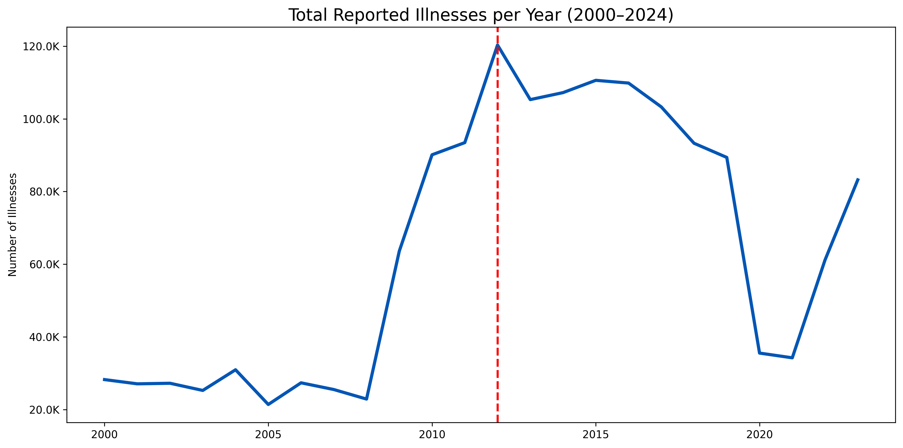
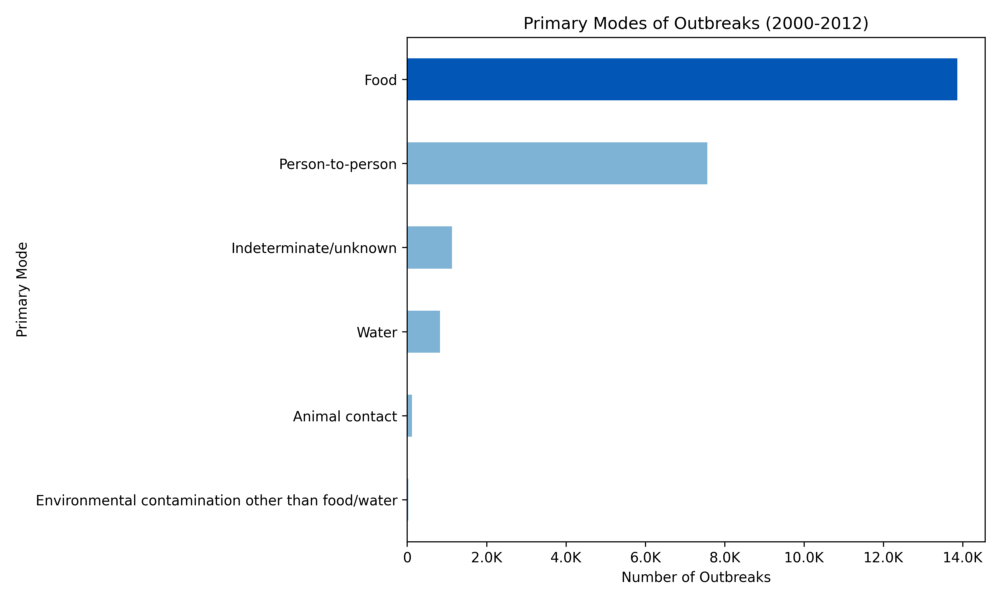
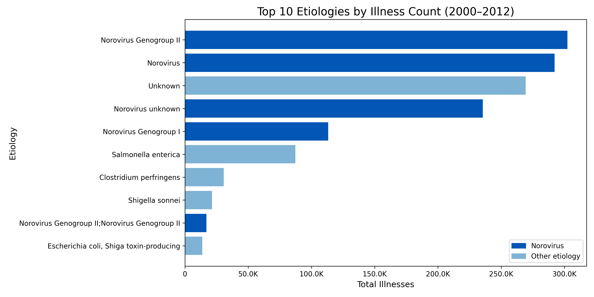
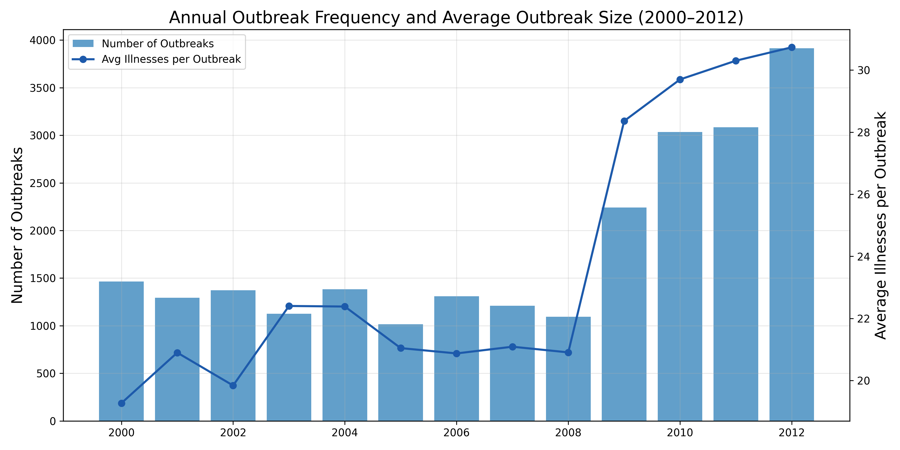

# NORS-Outbreak-Analysis

## Problem Statement
From 2000–2024, reported illnesses in the United States fluctuated nationally but spiked sharply in 2012, reaching 120,323 cases, a 326% increase from 2000. 

I was hired by the CDC to evaluate why illnesses peaked in 2012 by identifying the factors driving the post-2000 escalation, including shifts in transmission modes, seasonal patterns, and geographic distribution, to inform targeted outbreak prevention strategies.

## Executive Summary
This project explores U.S. outbreak-associated illness trends from 2000–2024 using the CDC’s National Outbreak Reporting System (NORS) dataset. The analysis focuses on understanding national illness patterns, identifying the drivers behind the sharp illness surge in 2012, and examining why illness counts did not return to pre-2012 baseline levels. Using exploratory data analysis (EDA) techniques, the dataset was cleaned, aggregated, and visualized to uncover trends across transmission modes, settings, geographic regions, seasonality, and etiologies. All data were imported using relative file paths to ensure full reproducibility across environments.

Key findings show that illnesses were relatively stable from 2000–2008 but rose sharply beginning in 2009, peaking at 120,323 illnesses in 2012. This peak was driven primarily by a surge in person-to-person transmission, strongly associated with norovirus activity during the 2009–2012 period. Seasonal winter peaks, increases in high-risk settings (such as long-term care facilities), and clustering in specific states all contributed to this rise. Although illness counts declined after 2012, they never returned to the low baseline levels of the early 2000s, suggesting sustained changes in outbreak patterns, reporting practices, or pathogen dynamics.

The analysis concludes that the 2012 spike reflects an intersection of increased outbreak frequency, expanded surveillance, and the emergence of highly transmissible norovirus strains. To support public health preparedness, recommendations include strengthening setting-specific prevention strategies, improving real-time surveillance for norovirus and other leading etiologies, and conducting deeper investigations into post-2012 sustained illness levels. These insights provide a foundation for targeted outbreak prevention and improved monitoring strategies.

## File Directory
```
├── README.md

├── Data
│   ├── NORS_original.csv
│   └── NORS_cleaned.csv

├── Code
│   ├── 01_Data_Cleaning.ipynb
│   └── 02_EDA.ipynb

├── Presentation
│   └── GA DS NORS EDA.pdf

├── Figures
│   ├── annual_illness_trends.png
│   ├── transmission_mode_shifts.png
│   ├── illnesses_by_etiology.png
│   ├── norovirus_illness_trends.png
│   ├── state_level_totals_2009_2012.png
│   ├── state_level_person_to_person_2009_2012.png
│   ├── seasonal_pattern_shift.png
│   ├── average_monthly_illnesses_2000_2012.png
│   ├── person_to_person_illnesses_by_setting.png
│   └── outbreaks_vs_severity_2000_2012.png
```

## Data and Data Dictionary
This project uses publicly available outbreak surveillance data from the CDC’s National Outbreak Reporting System (NORS), which compiles reports from state, local, and territorial health departments across the United States. The dataset contains 66,700 outbreak records and 19 variables. Each row represents one reported outbreak, including its exposure details, transmission characteristics, severity, and implicated sources.

CDC National Outbreak Reporting System — https://www.cdc.gov/nors/

The dataset was downloaded directly from the CDC and cleaned for analysis. This project uses outbreak-level, covering U.S. outbreaks from 2000–2024.

The following table reflects the final cleaned dataset used in the exploratory analysis:

| **Column Name**                  | **Data Type** | **Description** 
| -------------------------------- | ------------- | ----------------------------------------------------------------------------------- | 
| **Year**                         | int64         | Year of earliest reported illness onset                                             |
| **Month**                        | int64         | Month of earliest reported illness onset onset                                      |
| **Date**                         | datetime64    | Parsed date representing the year and month of earliest reported illness onset      |
| **State**                        | object        | State where exposure occurred                                                       |
| **Primary Mode**                 | object        | Primary mode of transmission                                                        |
| **Etiology**                     | object        | Identified pathogen (genus/species)                                                 |
| **Serotype or Genotype**         | object        | Serotype or genotype information for the identified etiology                        |
| **Etiology Status**              | object        | Indicates whether the etiology is reported as “Confirmed” or “Suspected”            |
| **Setting**                      | object        | Exposure setting                                                                    |
| **Illnesses**                    | float64       | Estimated total number of primary illness cases                                     |
| **Hospitalizations**             | float64       | Number of hospitalized primary cases                                                |
| **Deaths**                       | float64       | Number of deaths among primary cases                                                |
| **Food Vehicle**                 | object        | Implicated food(s) for foodborne outbreaks                                          |
| **Food Contaminated Ingredient** | object        | Contaminated ingredient(s) identified in foodborne outbreaks                        |
| **IFSAC Category**               | object        | IFSAC-assigned food category of the contaminated ingredient                         |
| **Water Exposure**               | object        | Type of water exposure                                                              |
| **Water Type**                   | object        | Venue, water system, or device through which water exposure occurred                |
| **Animal Type**                  | object        | Type of animal involved in animal-contact outbreaks                                 |

## Limitations
1. Population-Level Data 
This analysis uses outbreak-level, population-aggregated data from NORS. Individual-level risk factors, demographics, or behaviors could not be assessed, limiting insights into which specific populations were most affected.

2. Ecological Fallacy Risk
Observed associations at the state or national level may not apply to individuals. Caution is needed when inferring individual-level risk from population-level trends.

3. Data Completeness and Reporting Variability
NORS relies on reports from state and local health departments, which may differ in reporting standards, timeliness, and completeness. Changes in reporting practices over time could influence observed trends, particularly the post-2012 sustained illness levels.

4. Limited Covariates
Only outbreak characteristics captured in NORS—such as transmission mode, setting, and etiology—were available. Factors like population density, socioeconomic status, or individual susceptibility could not be included.

5. Geographic Aggregation
Analysis is primarily at the state and national levels, which may mask local hotspots or variations within states.

## Conclusions and Recommendations
Analysis of U.S. outbreak-associated illness trends from 2000–2024 reveals that the 2012 spike in reported illnesses was driven by multiple converging factors, including increased outbreak frequency, a shift toward person-to-person transmission, and concentrated activity in high-burden states. The surge aligns closely with the emergence of highly transmissible norovirus GII.4 variants, particularly the Sydney 2012 strain, and was further amplified by seasonal winter peaks and high-risk settings such as long-term care facilities and schools. Although illness counts declined after 2012, they did not return to pre-2000 baseline levels, likely due to ongoing circulation of transmissible strains, improved surveillance, and persistent person-to-person transmission.

Based on these findings, public health efforts should prioritize targeted prevention strategies in high-risk settings, strengthen winter-season surveillance, continue optimizing outbreak reporting systems, expand public education on hygiene and exclusion policies, and support research into a potential norovirus vaccine. These measures will enhance preparedness and mitigate future large-scale outbreaks.

## Areas for Further Research/Study
Future analyses should examine why illness counts remained above early-2000 levels, including prolonged circulation of high-transmissibility norovirus GII.4 variants and changes in national reporting practices or surveillance sensitivity. Additional research should investigate demographic patterns to determine which populations were disproportionately affected. State-level reporting differences should also be evaluated to understand variation in observed trends. Additionally, pathogen-level monitoring of emerging norovirus genotypes—paired with external dataset validation—would provide deeper insight into evolving outbreak dynamics. Finally, analyses should explore the role of other pathogens, environmental factors, and contextual influences.

## Sources
Barclay, L., Wikswo, M. E., Gregoricus, N., Vinjé, J., Lopman, B. A., Parashar, U. D., & Hall, A. J. (2013). Notes from the field: Emergence of new norovirus strain GII.4 Sydney — United States, 2012. MMWR. Morbidity and Mortality Weekly Report, 62, 55. 

Centers for Disease Control and Prevention. (2024, December 30). NORS data set. data.cdc.gov. https://data.cdc.gov/Foodborne-Waterborne-and-Related-Diseases/NORS/5xkq-dg7x/about_data

Eden, J. S., Tanaka, M. M., Boni, M. F., Rawlinson, W. D., & White, P. A. (2014). Recombination within the pandemic norovirus GII.4 lineage. Journal of Virology, 87(11), 6270–6282. https://doi.org/10.1128/JVI.03335-12

Lopman, B. A., Hall, A. J., Feng, Z., & Parashar, U. D. (2015). Norovirus–associated hospitalizations
among U.S. children, 2000–2009. The Journal of Infectious Diseases, 211(7), 1070–1077. 

Mattison, K., Bruggink, L., Middaugh, J., & Cook, A. (2010). Norovirus and medically attended gastroenteritis in U.S. children. Clinical Infectious Diseases, 50(1), 32–38. https://doi.org/10.1086/648426

## Key visualizations
* Figure 1. Annual Illness Trends (2000–2024)


* Figure 2. Transmission Modes Over Time (2000–2012) 


* Figure 3. Illnesses by Etiology (2000-2012) 


* Figure 4. Outbreak Frequency and Average Outbreak Size (2000–2012)

